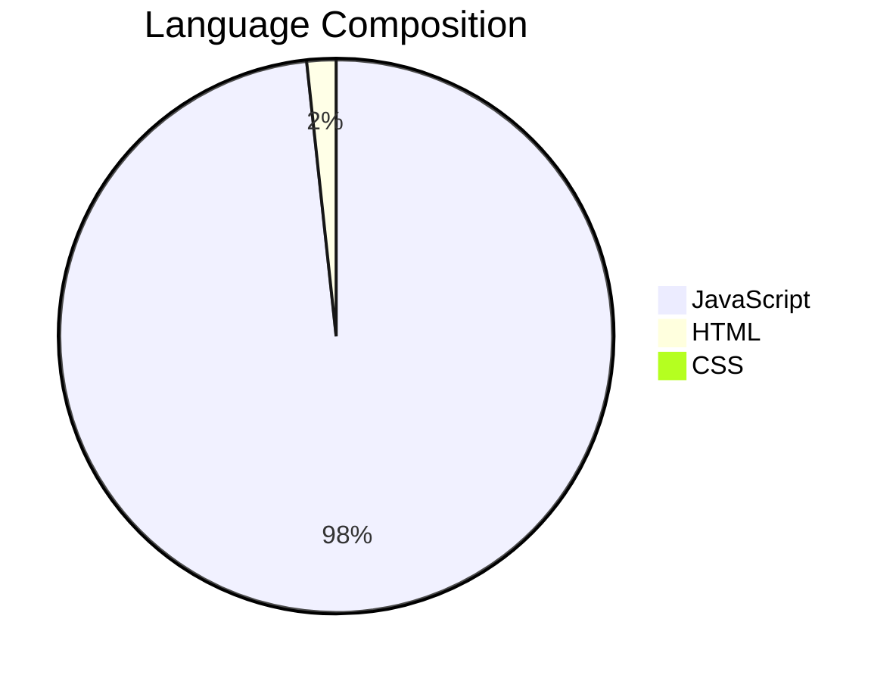
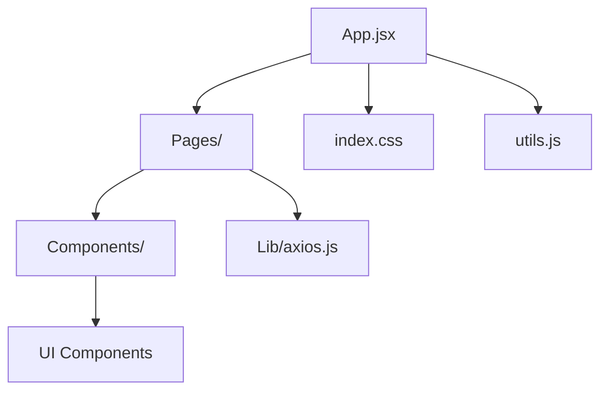
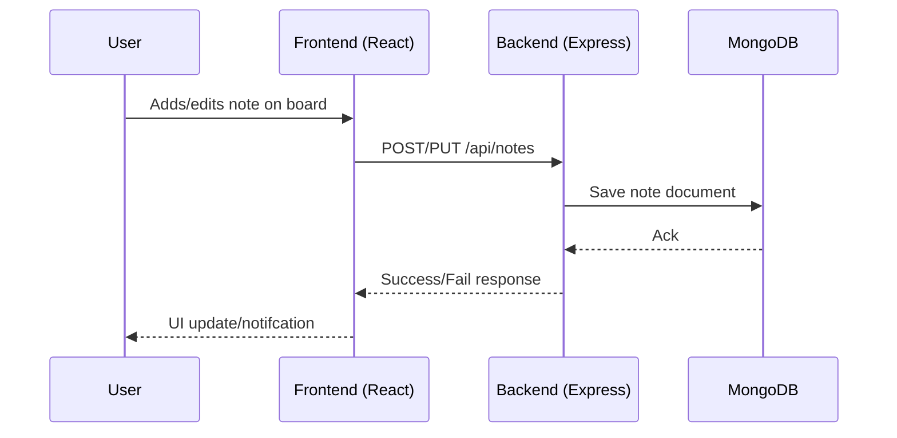

# ThinkerBoard

 <!-- Replace with your banner image or remove if not needed -->

ThinkerBoard is an advanced, interactive web platform designed to help users capture, organize, and visualize their thoughts or project notes using a collaborative board. It’s tailor-made for individuals and teams who want a seamless brainstorming, planning, and task-tracking experience.

---

## 🌐 Live Demo

<!-- If deployed, provide the link here -->
[Live App](#) 

---

## 📊 Tech Stack and Visual Architecture

| Layer    | Tech/Library         | Description                                   |
|----------|---------------------|-----------------------------------------------|
| Backend  | Node.js, Express.js | RESTful API, routing, business logic          |
| Database | MongoDB (+ Upstash) | Data persistence & caching mechanism          |
| Frontend | React (Vite)        | SPA architecture, fast development, UI rendering |
| HTTP     | Axios               | API communication between Frontend & Backend  |
| Styling  | CSS                 | Custom component and layout styling           |
| Auth/Caching | Upstash         | Provides rate limiting and possibly session storage |
| Misc     | dotenv, ESLint      | Env config, code linting for best practices   |

### 🖼️ Language Composition



---

## 🗂️ Detailed File Structure

Below is the expanded directory and major file listing, as per the actual source tree:

```
THINKERBOARD/
├── .vscode/
├── backend/
│   ├── node_modules/
│   ├── src/
│   │   ├── config/
│   │   │   ├── db.js
│   │   │   └── upstash.js
│   │   ├── controllers/
│   │   │   └── notesControllers.js
│   │   ├── middleware/
│   │   │   └── rateLimiter.js
│   │   ├── models/
│   │   │   └── note.js
│   │   ├── routes/
│   │   │   └── notesRoutes.js
│   │   └── server.js
│   ├── .env
│   ├── package.json
│   └── package-lock.json
├── frontend/
│   ├── .vite/
│   ├── dist/
│   ├── node_modules/
│   ├── public/
│   │   └── logo.png
│   ├── src/
│   │   ├── components/
│   │   ├── lib/
│   │   │   ├── axios.js
│   │   │   └── utils.js
│   │   ├── pages/
│   │   ├── App.jsx
│   │   ├── index.css
│   │   ├── main.jsx
│   │   └── index.html
│   ├── .eslintrc.js
│   ├── package.json
│   ├── package-lock.json
│   ├── README.md
│   └── vite.config.js
├── .gitignore
└── package.json
```

---

## 🚦 Backend Stack Details

- **Node.js** & **Express.js**:  
  Handle routing, server logic, and API endpoints.  
- **MongoDB**:  
  Used as the main document store for notes and user data.
- **Upstash**:  
  Primarily for caching and rate-limiting middleware.

**Example Backend Architecture Flow**:
flowchart TD
    C[Client Request] --> E[Express Server]
    E --> R[Routing - notesRoutes.js]
    R --> M[Controller - notesControllers.js]
    M --> DB[MongoDB]
    E --> RL[RateLimiter - Upstash]
    RL -.-> E
```

---

## 🎨 Frontend Stack Details

- **React (with Vite)**:  
  Handles the SPA structure; Vite provides an ultra-fast development environment.
- **Axios**:  
  Used for all HTTP API requests between frontend and backend.
- **CSS**:  
  Core styles, both global and per-component.

**Frontend Visual Structure**


---

## 📂 Example Visualization: API Communication



---

## 🚀 Getting Started

1. **Clone the Repo**
   ```sh
   git clone https://github.com/Priyanshu2229140/ThinkerBoard.git
   cd THINKERBOARD
   ```

2. **Backend Setup**
   ```sh
   cd backend
   npm install
   ```
   - Configure your `.env` with MongoDB and Upstash credentials.
   - Run the backend:
     ```sh
     npm start
     ```

3. **Frontend Setup**
   ```sh
   cd ../frontend
   npm install
   npm run dev
   ```
   - Visit [http://localhost:5173](http://localhost:5173) in your browser (Vite default port).

---

## 🤝 Contributing

PRs and suggestions are welcome! Please fork and submit a pull request after making your changes.

---

## 📄 License

MIT License.  
See [LICENSE](LICENSE) for more info.

---

## ⭐ Acknowledgments

- [React](https://react.dev/)
- [Vite](https://vitejs.dev/)
- [Express.js](https://expressjs.com/)
- [MongoDB](https://mongodb.com/)
- [Upstash](https://upstash.com/)
- Open Source Community
